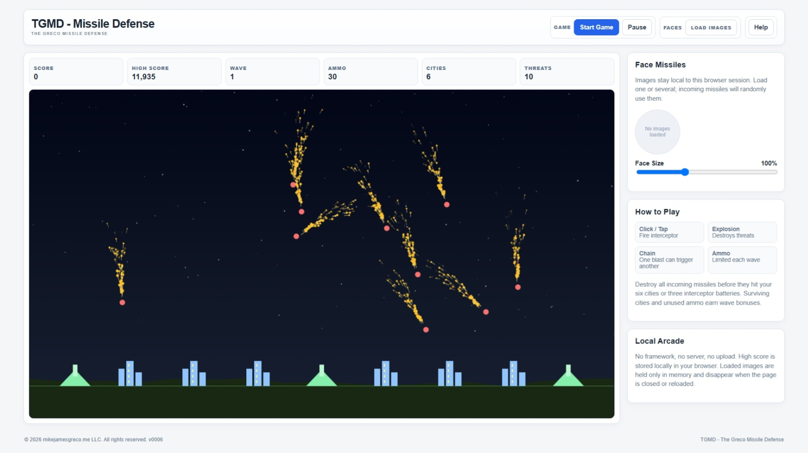

# TGMD - Missile Defense

**The Greco Missile Defense**

A lightweight, local-first browser missile defense game where your
friends, foes, or favorite faces become the incoming targets.

TGMD is built as a **Single-File Local Application (SFLA)**. The game
runs directly in a modern browser with no application server, package
manager, framework, installation process, or third-party runtime
dependencies.

Load your own local images, crop the faces or objects you want to use,
and defend your cities from the incoming targets.

> **Your faces. Your missiles. Defend your cities.**



## Play TGMD

**[▶ Play TGMD - Missile Defense in your
browser](https://mikejamesgreco.github.io/tgmd-missile-defense/)**

No installation is required. The GitHub Pages version runs TGMD directly
in your browser, just like opening the standalone
`tgmd-missile-defense.html` file locally.

------------------------------------------------------------------------

## Features

-   Load multiple local images
-   Interactive crop tool for selecting the face or image area to use
-   Faces and images displayed on incoming missile targets
-   Missile trails, sparks, explosions, and chain reactions
-   Increasing waves and difficulty
-   Limited interceptor ammunition
-   Six cities and three interceptor batteries
-   Surviving-city and ammunition bonuses
-   Local high score
-   Mouse and touch controls
-   Browser-generated sound effects
-   Single-file HTML application
-   No frameworks or third-party runtime dependencies

------------------------------------------------------------------------

## Getting Started

You can either use the **[hosted TGMD
game](https://mikejamesgreco.github.io/tgmd-missile-defense/)** or
download/clone the repository and open:

``` text
tgmd-missile-defense.html
```

in a modern web browser.

Choose **Load Images** to select one or more pictures from your
computer. Click a loaded image to crop and frame the face or object you
want to appear on the incoming missiles, then start the game and defend
your cities.

No installation, web server, or build process is required.

------------------------------------------------------------------------

## Local-First

TGMD is designed to keep the game simple and your images local.

Images selected in TGMD are processed in your browser and are not
uploaded to a TGMD server. They are used for the game session and remain
under your control.

TGMD follows the same **Single-File Local Application (SFLA)**
philosophy as the other Greco browser applications: use browser-native
capabilities where practical and avoid unnecessary runtime
infrastructure.

------------------------------------------------------------------------

## Repository Structure

The repository can remain very simple:

``` text
tgmd-missile-defense/
│
├── index.html                    # GitHub Pages launcher
├── tgmd-missile-defense.html     # Standalone TGMD game
├── screenshot.jpeg               # Project screenshot
├── README.md
└── LICENSE
```

------------------------------------------------------------------------

## Browser Support

TGMD is designed for modern desktop browsers. Mouse and touch controls
are supported, although exact browser behavior for features such as
generated speech and audio can vary.

------------------------------------------------------------------------

## Privacy

Your selected images remain local to your browser and are used only by
the game. TGMD does not require an account, backend service, or image
upload.

------------------------------------------------------------------------

## License

See the repository `LICENSE` file for details.

------------------------------------------------------------------------

## Author

**Michael J. Greco**

TGMD - Missile Defense --- **The Greco Missile Defense**

© mikejamesgreco.me LLC. All rights reserved.
